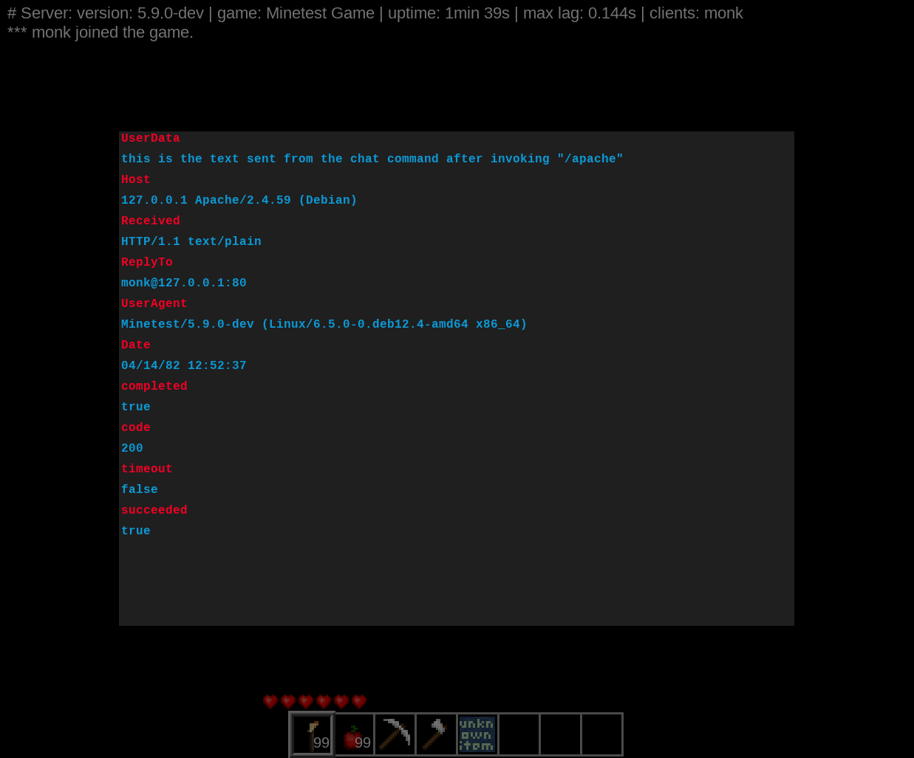

Apachetest
----------

A bridge between Minetest and Apache2.

MIT (c) 2024 monk

___

Requires Apache httpd version 2.3 or later.

It is highly recommend to use latest version with patch, which added support for Lua 5.4, and contains rather important [Security patches](https://downloads.apache.org/httpd/CHANGES_2.4).

 > [!WARNING]
 > It is not recommended that you use this module on a server that is shared with users you do not trust, as it can be abused to change the internal workings of httpd.

This package currently contains the bare minimum required to demonstrate functionality.

___

### sites-enabled

Include the following VirtualHost directives to an enabled site, by default it is 000-default.conf.

```conf
  LoadModule lua_module modules/mod_lua.so
  <Files "*.lua">
      SetHandler lua-script
  </Files>
```
___

### www/html

Add index.lua to the http document root folder. This is defaulted to /var/www/html/ in Debian. Below are two options:

```lua
-- Option 1:
--[[ Formatted 'data' field (see screenshot).
      Not compatible with web browser. ]]
  require "string"
  function handle(r)
    r.content_type = "text/plain"
    if r.method == 'GET' then
      r:puts('return{',
        'Date = "'..os.date("%x %X",r:clock())..'",',
        'Host = "'..r.server_name..' '..r.banner..'",',
        'Received = "'..r.protocol..' '..r.content_type..'",',
        'ReplyTo = "'..r:headers_in_table().Name..'@'..r.useragent_ip..':'..r.port..'",',
        'UserAgent = "'..r:headers_in_table()["User-Agent"]..'",',
        'UserData = "'..r:headers_in_table().Userdata:gsub("\"","\\\"")..'"}'
      )
      return apache2.OK
    end
  end
```
```lua
-- Option 2:
--[[ Unformatted 'data' field, compatible with browser. ]]
function handle(r)
  r.content_type = "text/html"
  if r.method == 'GET' then
    for i, n in pairs(r:headers_in_table()) do
      r:puts(i.."-> ".. n.."\n")
    end
  end
  r:puts("Hi Minetest, from Apache2")
  return apache2.OK
end
```

Many example functions for mod_lua can be found in the docs linked at the end of this readme.

___

### mod_lua

Enable the Lua module for Apache2:

```bash
$ sudo /usr/sbin/a2enmod lua

Enabling module lua.
To activate the new configuration, you need to run:
  systemctl restart apache2
```

Start or restart Apache to apply the configurations

___

### minetest.conf

Include within your minetest.conf:

```conf
secure.http_mods = apachetest
apache2_url = http://127.0.0.1:80/index.lua
```

___

### apachetest

Add apachetest folder to your mods or worldmods folder, start Minetest server.

The chatcommand `/apache [text]` sends an HTTP request to Apache httpd, and the reply is presented on-screen in formspec:



Congratulations! You now have a bridge connecting a Minetest server to an Apache HTTP server.

___

### Documentation

- > [Apache Module mod_lua](https://httpd.apache.org/docs/trunk/mod/mod_lua.html)

- > [Hook Functions in the Apache HTTP Server 2.x](https://httpd.apache.org/docs/trunk/developer/hooks.html)

- > [Creating hooks and scripts with mod_lua](https://httpd.apache.org/docs/trunk/developer/lua.html)


- > [HTTP Request definition](https://github.com/minetest/minetest/blob/master/doc/lua_api.md#httprequest-definition)

- > [HTTPRequestResult definition](https://github.com/minetest/minetest/blob/master/doc/lua_api.md#httprequestresult-definition)
